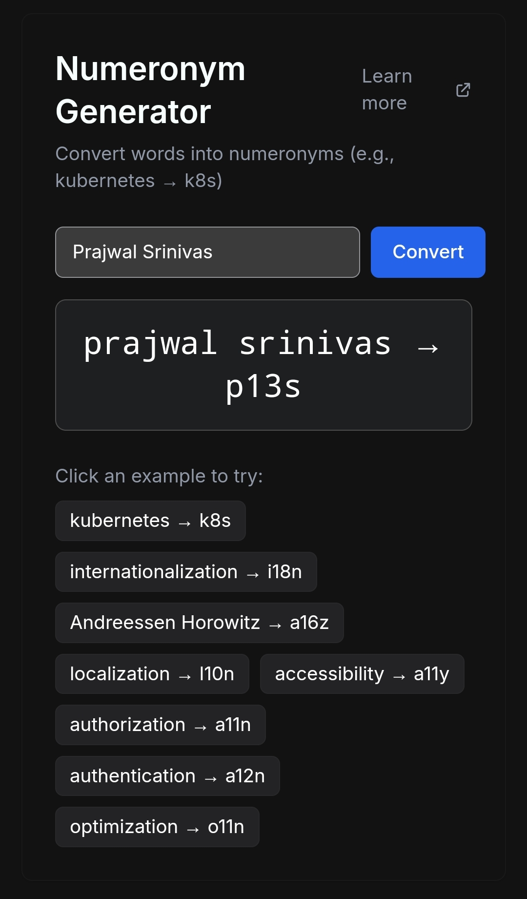

# Numeronym Generator

A simple [web tool](https://gen-numeronym.onrender.com/) that converts words into numeronyms (e.g., kubernetes → k8s, internationalization → i18n).

## Overview

This tool provides:
- Real-time word to numeronym conversion
- Common examples like k8s, i18n, l10n, a11y
- Special case handling (e.g., "Andreessen Horowitz" → "a16z")
- Modern, responsive UI

## Fun fact:
- I created this entirely on my phone (as opposed to using a PC), used the claude mobile app, iterated over a few versions and previewed it using the artifacts feature.
- Then signed up on render, looked up steps to deploy a static site and deployed it.
- Then created a quick readme using claude, and added a screenshot.
- Even though this is a super simple app, being able to create and deploy it on a phone was a different experience!
